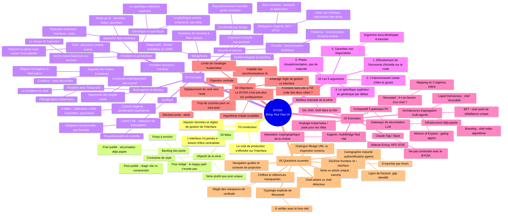

# BYOIA — Mindmap complet

Généré le 2026-07-11 à partir de l'ensemble des fichiers du dossier.

```mermaid
mindmap
  root((BYOIA<br/>Bring Your Own IA))
    (Fil conducteur)
      Séparer données et règles de gestion de l'interface
      Le coût de production s'effondre sur l'interface
      L'interface n'a jamais eu besoin d'être centralisée
    (00 Méta)
      Objectif de la série
        Série plutôt que post unique
        Contrainte de style
      Backlog des posts
        Posts à enrichir
        Post publié : sécurisation déjà payée
        Post publié : réagir vite vs comprendre
        Post rédigé : le happy path n'existe pas
    (01 Concepts)
      Frontière et architecture
        Générique vs spécifique
          Le générique comme compromis, pas idéal
          Le spécifique redevient supérieur
        Approche data-centrique
          Reste au SI : données, règles, garanties
          Redevient individuel : interfaces, outils
        Frontière structure / interface
        Accès conversationnel aux services
          La charge de traduction
        DCB : décisions comme events
          Réécrire le passé sans casser l'immutabilité
      Sécurité et identité
        Délégation d'agents JWT / mTLS
          Deux couches : transport et application
          Claim act imbriqué, intersection des droits
        Presidio : anonymisation technique
          Problème : reconstruction en sens inverse
        Argument IA locale : souveraineté
        Conformité par design
          Repositionnement honnête après correction
      Juridique
        Cadre CSE : obligation de consultation
          Obligation fonctionnelle, pas formelle
          Proportionnalité du contrôle
      Multi-agents et décision
        Sagesse des foules : Condorcet
          Régime homogène vs hétérogène
          Condition : biais décorrélés
        Conseil d'agents : pondération bayésienne
          4 failles : calibration, crédit, échantillon, granularité
        Taxonomie des angles morts
          Construite empiriquement, pas a priori
        Parallèle avec l'holacratie
          Pilotage façon Kubernetes
          Le problème du chef
      Métaphores
        Paradoxe de l'armoire à fibre optique
        Épidémiologiste du backlog
        Happy path : illusion statistique du 20/80
    (02 Les 5 arguments)
      1. Effondrement de l'économie d'échelle sur le code
      2. L'interconnexion cesse d'être le goulot
      3. Phase d'expérimentation, pas de maturité
      4. Le spécifique supérieur au générique par défaut
      5. Garanties non négociables
        Argument sous-développé, à trancher
    (03 Exemples)
      Claude Tag / Slack
        Ne pas confondre avec le BYOIA
      Git, DoD, DoR dans la DSI
        Meilleur exemple de la série
      Analogie Kubernetes / pods pour les rôles
      Kagenti / AuthBridge Red Hat
        Sidecar Envoy, RFC 8705
        Attestation cryptographique de la chaîne
      Gateways de sécurisation LLM
        Comparatif 5 gateways PII
        Infrastructure déjà payée
      Architectures d'agrégation multi-agents
        Mixture of Experts : gating appris
        Boosting : chef méta-algorithme
        BFT : chef point de défaillance unique
        Liquid Democracy : chef révocable
      Moussaïd : A-t-on besoin d'un chef ?
        Mapping en 3 régimes, inféré
    (04 Objections)
      Le BYOIA n'est pas plus sûr juridiquement
        Hypothèse initiale invalidée
        Objection centrale
      Déplacement du coût vers l'aval
      Frontière tient-elle si l'IA code des deux côtés ?
      Arbitrage règle de gestion vs interface
      Fiabilité des synchronisations IA
      Limite de l'analogie Kubernetes
      Trop de couches pour un seul post
        Décision prise : série
    (05 Questions ouvertes)
      Doctrine frontière SI / interface
        À trancher par Kevin
      Série vs article unique : tranché
      Chiffres et références manquantes
        Règle des marqueurs de certitude
      Cartographie maturité authentification agents
        Ligne de fracture, gap identifié
      Chef-arbitre vs chef-détecteur
      Typologie explicite de Moussaïd
        À vérifier avec le livre réel
      Navigation guidée et contexte de projection
      Distinguo filtrage URL vs inspection contenu
```
